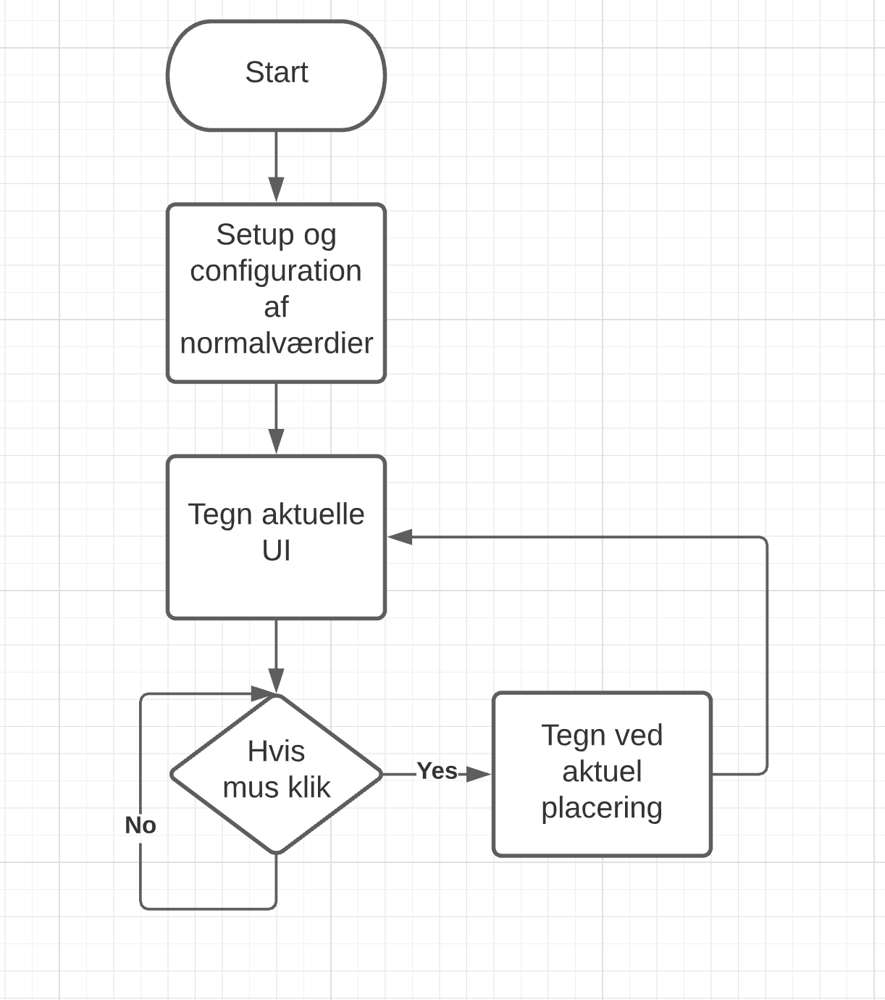
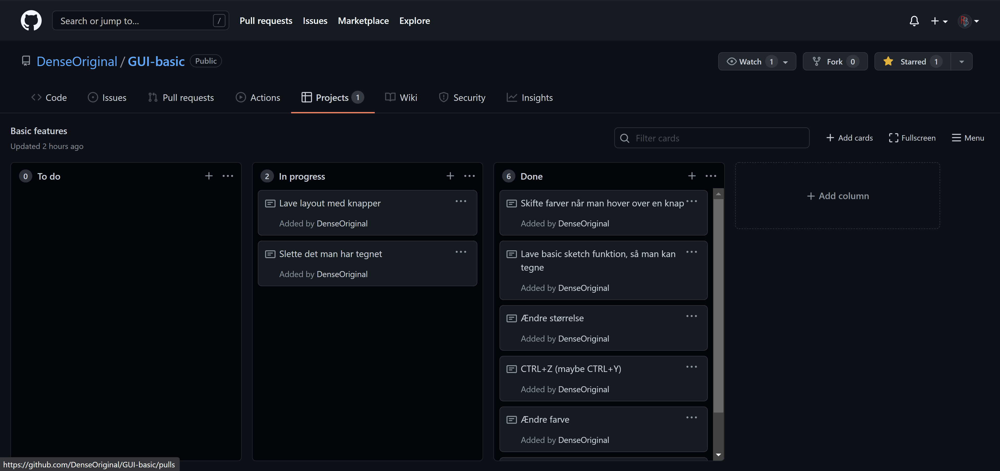
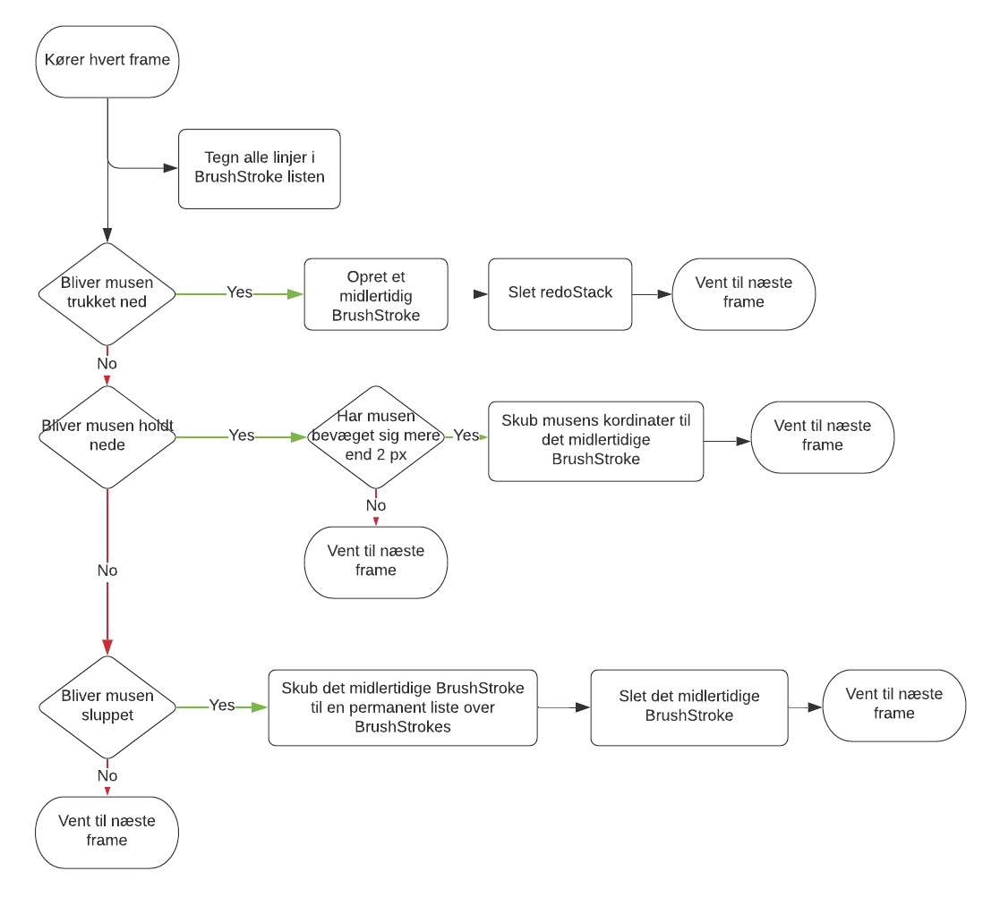

# DDD

## DESIGN (D1)

### Flowchart af overordnet program



### Pseudo-kode af umiddelbare knap klasse og test implementation

```js
class knap () {
    constructor(x,y,w,h text) {
        this.x = x;
        this.y = y;
        this.w = w;
        this.h = h;
        this.text = text;
    }

    opdaterKnap() {
        rect(this.x,this.y,this.x+this.w,this.y+this.h);
        text(this.x,this.y,this.text)
    }
}

setup() {
    nyKnap = new knap(100,100,"hej");
}
draw() {
    nyKnap.opdaterKnap();
}
```

### Udviklings process



## DOKUMENTATION (D2)

Flowchart der beskriver macro delen af hvordan vi tegner og opretter linjerne på skærmen.


## DELING (D3)


